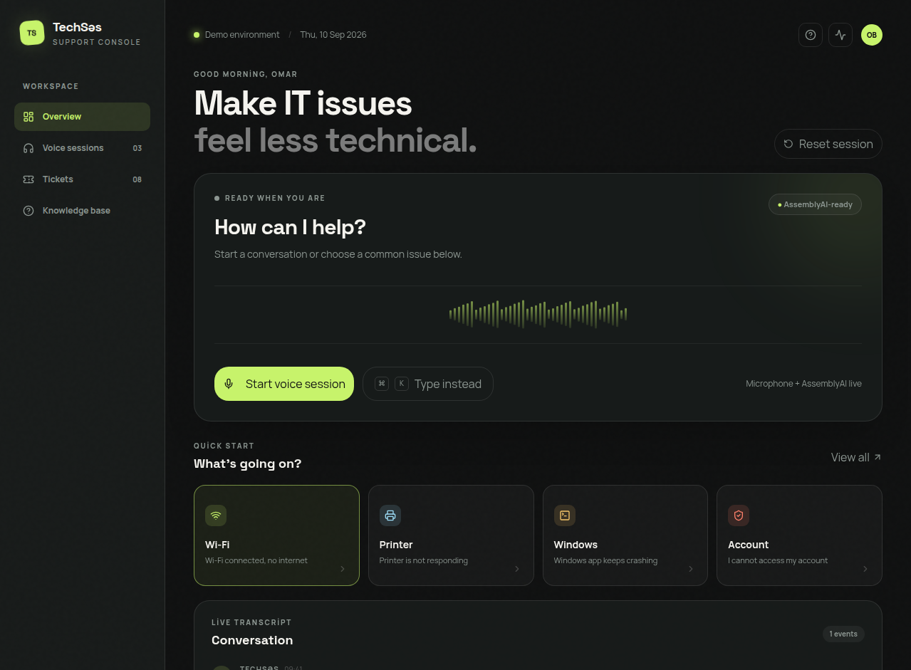
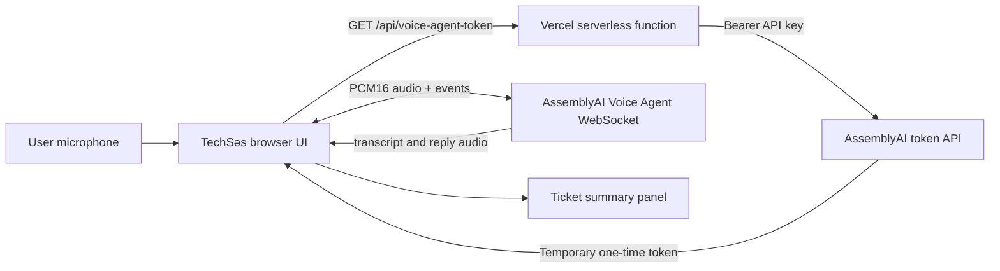

# TechSəs

## Voice-first IT Help Desk for real-time support

TechSəs is a voice-first IT support agent built for the **AssemblyAI Voice Agent Hackathon**. It helps users describe technical problems naturally, receives live microphone audio, and responds with short troubleshooting guidance in the same language. The current MVP focuses on a polished support-console experience, real-time AssemblyAI Voice Agent integration, live transcript updates, agent audio playback, and ticket-summary preparation.

> **Live demo:** [techses-voice-agent.vercel.app](https://techses-voice-agent.vercel.app)  
> **Repository:** [github.com/etikhacker/techses-voice-agent](https://github.com/etikhacker/techses-voice-agent)



## Why TechSəs

IT support often starts with an incomplete description such as “Wi-Fi is connected but nothing opens” or “the printer stopped responding.” TechSəs turns that unstructured conversation into a guided support flow. The user speaks naturally, the agent identifies the issue, proposes a practical next step, and prepares a concise ticket summary when escalation is needed.

The experience is designed for help-desk operators and end users rather than for developers. The interface makes the current voice state, transcript, issue category, suggested action, and ticket status visible in one console.

## Core capabilities

| Capability | Implementation |
| --- | --- |
| Real-time voice conversation | AssemblyAI Voice Agent API over WebSocket |
| Secure browser authentication | Short-lived server-generated AssemblyAI token; permanent key stays server-side |
| Microphone input | Browser `getUserMedia` with echo cancellation and noise suppression |
| Audio transport | Base64 PCM16, 24 kHz mono audio frames |
| Agent output | Streaming PCM audio decoded and scheduled through the Web Audio API |
| Live transcript | User and agent transcript events rendered in the conversation panel |
| IT issue shortcuts | Wi-Fi, printer, Windows, and account issue flows |
| Ticket preparation | Issue category, priority, suggested action, and draft ticket summary |
| Deployment | Vercel production deployment with a serverless token endpoint |
| Safe fallback | Demo issue flows remain usable if microphone access or live connection is unavailable |

## Architecture



The browser never receives the permanent `ASSEMBLYAI_API_KEY`. It requests a one-time token from `/api/voice-agent-token`, then opens the AssemblyAI WebSocket with that temporary token.

## Technology stack

- React 19 and TypeScript
- Vite and Tailwind CSS
- AssemblyAI Voice Agent API
- WebSocket and Web Audio API
- Express/tRPC development server fallback
- Vercel Serverless Functions
- Vitest
- GitHub Actions-ready project structure

## Local development

### Prerequisites

- Node.js 20 or newer
- pnpm 10 or newer
- An AssemblyAI API key

### Installation

```bash
git clone https://github.com/etikhacker/techses-voice-agent.git
cd techses-voice-agent
pnpm install
```

Create a local environment file for the server-side token route:

```bash
ASSEMBLYAI_API_KEY=your_assemblyai_api_key
```

Never commit `.env` files or permanent API keys. The repository already ignores environment files.

### Run the project

```bash
pnpm dev
```

The WebDev development server uses the tRPC token procedure as a fallback. In Vercel, the browser uses the serverless route at `/api/voice-agent-token`.

### Verify the project

```bash
pnpm test
pnpm check
pnpm build
```

The test suite validates AssemblyAI credentials, temporary token generation, the Vercel token route, and the auth logout contract.

## Deployment

The GitHub repository is connected to the Vercel project. Pushes to `main` trigger a production deployment.

Configure this secret in the **Production** and **Preview** environments:

| Variable | Purpose |
| --- | --- |
| `ASSEMBLYAI_API_KEY` | Server-side authentication for temporary Voice Agent tokens |

The Vercel build uses `vercel.json` to serve `dist/public` as the frontend while keeping `api/voice-agent-token.ts` as a serverless function.

## Demo flow

1. Open the live demo.
2. Select **Start voice session**.
3. Allow microphone access.
4. Speak in Azerbaijani or English, for example: “Wi-Fi qoşulub, amma internet işləmir.”
5. Review the live transcript and agent response.
6. Use **Create ticket summary** when escalation is appropriate.
7. If microphone access is unavailable, use the issue shortcuts to demonstrate the support and ticket flow.

## Security notes

The permanent AssemblyAI key is stored only as a server-side environment variable. The browser receives a short-lived, one-time token and uses it only to open a single Voice Agent session. The token route does not return or log the permanent key.

The current MVP does not persist ticket data to a production database. Ticket creation is intentionally presented as a polished demo workflow and is ready for the next database-backed iteration.

## Roadmap

- Persist tickets and transcript summaries in the project database.
- Add AssemblyAI tool calling for automated ticket creation and status updates.
- Add an operator ticket history view with search and priority filters.
- Add authentication and role-based operator workspaces.
- Add issue-specific knowledge-base retrieval for more precise troubleshooting.

## References

[1]: https://www.assemblyai.com/docs/voice-agents/voice-agent-api "AssemblyAI Voice Agent API documentation"
[2]: https://www.assemblyai.com/docs/voice-agents/voice-agent-api/api-spec/voice-agent-websocket "AssemblyAI Voice Agent WebSocket API"
[3]: https://vercel.com/docs/functions "Vercel Functions documentation"
