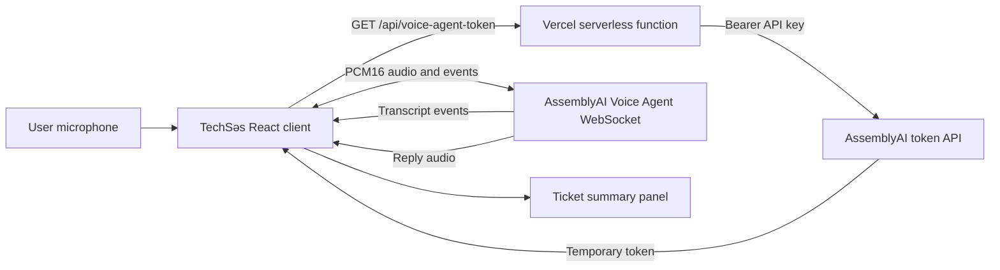

# TechSəs

## Voice-first IT Help Desk powered by AssemblyAI

TechSəs is a real-time voice support console for everyday IT problems. A user describes an issue naturally through a microphone, receives spoken troubleshooting guidance, sees the live conversation transcript, and can turn the conversation into a structured escalation ticket.

The project was built as a solo submission for the **AssemblyAI Voice Agent Hackathon** by **Omar / etikhacker**.

[](https://techses-voice-agent.vercel.app)
[](https://github.com/etikhacker/techses-voice-agent)
[](https://www.assemblyai.com/)


## Why TechSəs?

IT support frequently begins with an incomplete description such as “Wi-Fi is connected but nothing opens” or “the printer stopped responding.” Users should not need to understand technical terminology before they can receive useful help.

TechSəs provides a voice-first support flow that is easier to start and easier to understand. The user speaks naturally. The agent identifies the support context, suggests a practical next step, keeps the transcript visible, and prepares a concise ticket summary when human escalation is appropriate.

## Core workflow

```text
Speak naturally
      |
      v
AssemblyAI Voice Agent receives the conversation
      |
      +--> live user transcript
      +--> spoken agent response
      +--> suggested troubleshooting action
      |
      v
Create a structured ticket summary when escalation is needed
```

## Features

| Feature | Description |
| --- | --- |
| Real-time voice session | Captures microphone input and connects the browser to the AssemblyAI Voice Agent WebSocket. |
| Live transcript | Displays user and agent messages as the conversation progresses. |
| Spoken troubleshooting | Streams agent audio back to the browser through the Web Audio API. |
| Issue shortcuts | Includes focused flows for Wi-Fi, printer, Windows, and account problems. |
| Ticket preparation | Creates a structured draft containing issue category, priority, suggested action, and escalation context. |
| Secure token flow | Generates short-lived AssemblyAI tokens on the server; the permanent API key is never sent to the browser. |
| Safe fallback | Keeps the issue-demo flows usable when microphone permission or a live connection is unavailable. |
| Responsive support console | Works across desktop and mobile layouts. |

## Technical architecture



### Security model

The browser does not receive the permanent `ASSEMBLYAI_API_KEY`. Instead, it requests a short-lived token from the server-side `/api/voice-agent-token` function. The temporary token is then used to establish the voice-agent WebSocket session.

This separation keeps the long-lived credential in the Vercel environment and limits the value of any browser-visible session token.

## Technology stack

| Layer | Technology |
| --- | --- |
| User interface | React 19, TypeScript, Vite, Tailwind CSS |
| Voice agent | AssemblyAI Voice Agent API over WebSocket |
| Audio input | Browser `getUserMedia`, PCM16 audio frames, 24 kHz mono |
| Audio output | Web Audio API with scheduled PCM playback |
| Backend token route | Vercel Serverless Function |
| Development backend | Express and tRPC |
| Testing | Vitest |
| Deployment | Vercel connected to GitHub |

## Live demo

Open the production application at **[techses-voice-agent.vercel.app](https://techses-voice-agent.vercel.app)**.

Try this example in Azerbaijani or English:

> “Wi-Fi qoşulub, amma internet işləmir.”

Then review the transcript, follow the suggested troubleshooting step, and select **Create ticket summary** when escalation is needed.

## Repository structure

```text
techses-voice-agent/
├── api/
│   └── voice-agent-token.ts       # Vercel token endpoint
├── client/
│   └── src/
│       ├── lib/issueData.ts       # Issue types and guided responses
│       └── pages/Home.tsx          # Main support console
├── docs/
│   ├── techses-dashboard.png      # Product screenshot
│   ├── techses-pitch.md           # Hackathon pitch source
│   └── techses-pitch.pdf          # Hackathon pitch deck
├── server/
│   ├── routers.ts                 # tRPC procedures
│   └── _core/                     # Server and runtime infrastructure
├── SPEC.md                        # MVP product specification
├── vercel.json                    # Vercel build configuration
└── README.md
```

## Run locally

### Prerequisites

- Node.js 20 or newer
- pnpm 10 or newer
- An AssemblyAI API key

### Install

```bash
git clone https://github.com/etikhacker/techses-voice-agent.git
cd techses-voice-agent
pnpm install
```

### Configure the API key

Create a local environment configuration for the server-side token route:

```env
ASSEMBLYAI_API_KEY=your_assemblyai_api_key
```

Do not commit `.env` files or permanent API keys. The API key must remain server-side.

### Start development

```bash
pnpm dev
```

The local development server exposes the tRPC token procedure as a fallback. On Vercel, the client uses `/api/voice-agent-token`.

## Validation

Run the project checks before opening a pull request or deploying a change:

```bash
pnpm test
pnpm check
pnpm build
```

The test suite covers the authentication contract, AssemblyAI credential handling, temporary-token generation, and the Vercel token route.

## Deployment

The GitHub repository is connected to the Vercel project. Pushes to `main` trigger a production deployment.

Configure `ASSEMBLYAI_API_KEY` in the **Preview** and **Production** environments. The `vercel.json` file configures the Vite output directory and keeps the token endpoint available as a serverless function.

## Current limitations

The current MVP is intentionally focused. It does not yet persist user accounts, ticket history, or organization-level help-desk data. The issue flows are curated for the initial demo rather than generated from a large enterprise knowledge base. Browser microphone permissions and network availability can also affect live-session behavior.

## Roadmap

1. Add multilingual issue classification and response preferences.
2. Add a searchable IT knowledge base with source-aware troubleshooting steps.
3. Persist ticket history for authenticated users.
4. Add integrations for common help-desk systems.
5. Add analytics for resolution time, escalation rate, and recurring issue categories.
6. Improve interruption handling and turn-taking for longer conversations.

## Hackathon submission links

- **Live demo:** [techses-voice-agent.vercel.app](https://techses-voice-agent.vercel.app)
- **GitHub repository:** [github.com/etikhacker/techses-voice-agent](https://github.com/etikhacker/techses-voice-agent)
- **Hackathon team:** [Omar Solo Voice AI on LabLab](https://lablab.ai/ai-hackathons/assemblyai-voice-agent-hackathon/omar-solo-voice-ai)

## License

This project is provided for hackathon and educational use. Add a formal open-source license before distributing it as a reusable library or commercial product.

## References

[1]: https://www.assemblyai.com/docs/voice-agents "AssemblyAI Voice Agents documentation"
[2]: https://www.assemblyai.com/docs/api-reference/voice-agent-api/generate-voice-agent-token "AssemblyAI Voice Agent token API"
[3]: https://vercel.com/docs/functions "Vercel Functions documentation"
[4]: https://developer.mozilla.org/en-US/docs/Web/API/Web_Audio_API "MDN Web Audio API documentation"
[5]: https://developer.mozilla.org/en-US/docs/Web/API/MediaDevices/getUserMedia "MDN getUserMedia documentation"
